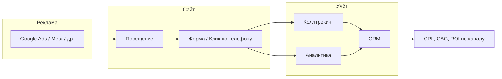

# Сквозная аналитика, коллтрекинг и программы

> [← Главный план](main.md)

---

## 1. Сквозная аналитика

### 1.1 Зачем нужна

Сквозная аналитика — это учёт всего пути от первого касания (реклама, поиск, переход на сайт) до целевого действия (заявка, звонок, заказ в [CRM](03-crm.md)). Без неё:

- Часть лидов «теряется» (особенно звонки).
- Невозможно корректно считать CPL и CAC по каналам (см. [расчёт кампаний](06-marketing-channels.md)).
- Сложно оптимизировать рекламу и посадочные страницы.

### 1.2 Что должно быть в контуре

| Элемент                 | Назначение                                                                                    |
| ----------------------- | --------------------------------------------------------------------------------------------- |
| **Источник трафика**    | Рекламная система, кампания, объявление (UTM или аналог)                                      |
| **Поведение на сайте**  | Просмотры, клики, скролл, время — для качества трафика                                        |
| **Целевые действия**    | Отправка формы, клик по телефону, клик по WhatsApp и т.д.                                     |
| **Звонки**              | Учёт номера, длительности, привязка к источнику (см. [Коллтрекинг](#2-коллтрекинг))           |
| **Результат в бизнесе** | Лид и сделка в [CRM](03-crm.md), источник проставлен, можно считать конверсию лид→заказ и CAC |

### 1.3 Схема потока данных

### 1.4 Что настроить по шагам

1. **Аналитика на сайте** (маркетинговая: GA4, Matomo; при необходимости продуктовая: PostHog): установка счётчика, цели — отправка формы, клик по телефону (и при необходимости клик по мессенджеру). Передача UTM-параметров из рекламы в отчёты.
2. **Связка с рекламой:** в Google Ads и Meta — импорт конверсий из аналитики или из CRM (если есть интеграция), чтобы оптимизировать кампании по реальным заявкам/звонкам.
3. **Коллтрекинг:** подмена номера на сайте на номер коллтрекинга, передача в коллтрекинг параметров источника (utm_source, utm_medium, utm_campaign); при звонке — создание лида в CRM или привязка к существующему с источником. Подробнее ниже.
4. **Единый источник правды:** в [CRM](03-crm.md) у каждого лида — один корректный источник. Отчёты по CPL/CAC строятся из CRM (лиды + расходы по каналам из рекламных кабинетов или из коллтрекинга).

### 1.5 Виды аналитики: маркетинговая и продуктовая

| Вид                                 | Задача                                                                                                                 | Примеры инструментов                     | Что даёт для детейлинга                                                                                                            |
| ----------------------------------- | ---------------------------------------------------------------------------------------------------------------------- | ---------------------------------------- | ---------------------------------------------------------------------------------------------------------------------------------- |
| **Маркетинговая / сквозная**        | Источники трафика, конверсии в лид (форма, звонок), атрибуция по каналам для CPL/CAC                                   | Google Analytics 4, Matomo               | Трафик по каналам, UTM, цели (отправка формы, клик по телефону), загрузка конверсий в рекламу                                      |
| **Продуктовая (product analytics)** | Поведение на сайте: воронки, сессии, записи кликов, тепловые карты, опросы; понимание, где пользователи «отваливаются» | **PostHog**, Hotjar, Mixpanel, Amplitude | Почему форма не отправляется, на каком шаге уходят с страницы цен, какие блоки смотрят; A/B-тесты и опросы для улучшения конверсии |

Оба вида дополняют друг друга: маркетинговая отвечает на вопрос «откуда пришли и сколько конвертировали», продуктовая — «как ведут себя на сайте и где теряем». Для сайта-визитки с одной формой заявки достаточно маркетинговой аналитики; при нескольких страницах, калькуляторе или сложной форме продуктовая аналитика (в т.ч. PostHog) помогает целенаправленно улучшать посадочные и форму. См. [PostHog: продуктовая аналитика](#25-posthog-продуктовая-аналитика) ниже.

---

## 2. Коллтрекинг

### 2.1 Зачем нужен

Значительная часть клиентов детейлинга звонит, а не оставляет заявку на сайте. Без коллтрекинга:

- Звонки не привязываются к источнику (Google Ads, Meta, органический поиск и т.д.).
- CPL и CAC по платным каналам занижаются (часть лидов считается «прямыми» или «неизвестными»).
- Невозможно понять, какая реклама реально приводит к звонкам.

### 2.2 Как это работает (кратко)

- На сайте отображается **подменённый номер** (выданный сервисом коллтрекинга).
- При переходе на сайт в cookie или в URL передаётся **источник** (UTM или динамическая подстановка).
- Когда клиент звонит по подменённому номеру, сервис фиксирует звонок и **источник** (из cookie/URL на момент визита).
- По настройкам: запись разговора (с соблюдением законодательства и согласия), уведомление менеджера, **создание лида в CRM** с проставленным источником или привязка к существующему контакту.

### 2.3 Юридические требования

- **Запись разговоров:** требуется информирование и, как правило, согласие абонента; хранение и сроки — по требованиям к персональным данным (GDPR и местное законодательство).
- **Политика конфиденциальности:** использование коллтрекинга и передача данных в третьи системы нужно отразить в политике конфиденциальности.

### 2.4 Интеграция с CRM

- Коллтрекинг должен передавать в [CRM](03-crm.md): номер звонящего, дату/время, источник (канал/кампания), при необходимости длительность и ссылку на запись.
- Идеально: автоматическое создание лида или сделки с источником «Google Ads», «Meta» и т.д., чтобы все лиды (форма + звонки) учитывались в [отчётах по каналам](06-marketing-channels.md).

### 2.5 PostHog: продуктовая аналитика

**PostHog** — платформа продуктовой аналитики (self-hosted или облако): события, воронки, записи сессий, тепловые карты, опросы, A/B-тесты, feature flags. Подходит, когда нужно не только считать конверсии, но и **понимать поведение** на сайте и улучшать форму и лендинги.

#### Зачем для сайта детейлинга

| Возможность                        | Для чего использовать                                                                                                                                            |
| ---------------------------------- | ---------------------------------------------------------------------------------------------------------------------------------------------------------------- |
| **События (events)**               | Отправка формы, клик по кнопке «Заказать», клик по телефону, переход на страницу цен — строить воронки (главная → услуги → форма).                               |
| **Записи сессий (session replay)** | Просмотр сессии пользователя: где скроллит, где кликает, на каком шаге бросает форму. Выявление причин низкой конверсии (путаница в полях, ошибка при отправке). |
| **Воронки (funnels)**              | Цепочка шагов (например: визит главной → переход на «Услуги» → открытие формы → отправка). Процент дохождения на каждом шаге.                                    |
| **Тепловые карты (heatmaps)**      | Где чаще кликают и скролят на странице; куда поставить кнопку заявки и какой блок дочитывают.                                                                    |
| **Опросы (surveys)**               | Всплывающий опрос после визита или после отправки формы («Что помешало оформить заявку?», «Оцените удобство сайта»).                                             |
| **A/B-тесты**                      | Сравнение вариантов заголовка, текста кнопки или блока цен; выбор лучшего по конверсии.                                                                          |
| **Feature flags**                  | Включение/выключение блоков или версий страницы без деплоя (например тест новой формы только для части трафика).                                                 |

#### Интеграция в сайт

1. **Установка:** скрипт PostHog на все страницы сайта (в `<head>` или перед `</body>`); для EU можно использовать EU-облако или self-hosted для контроля данных (GDPR).
2. **Базовые события:** автоматически собираются просмотры страниц (pageview); отправку формы и клики по ключевым кнопкам (телефон, WhatsApp, «Оставить заявку») отправлять как кастомные события (`posthog.capture('form_submitted')`, `posthog.capture('click_phone')` и т.д.).
3. **Запись сессий:** включить в настройках PostHog; при необходимости маскировать поля формы (пароли, ввод телефона/email) для соответствия политике конфиденциальности.
4. **UTM и источник:** PostHog по умолчанию сохраняет UTM-параметры и referrer — можно строить воронки и фильтровать сессии по источнику (Google Ads, Meta и т.д.).
5. **Согласие (GDPR):** перед загрузкой скрипта PostHog проверять согласие на аналитику (cookie banner); если согласия нет — не инициализировать PostHog или не записывать сессии. Указать использование PostHog в [политике конфиденциальности](05-website.md) сайта.

Подробнее по интеграции: [Сайт: аналитика и интеграции](05-website.md).

#### Когда подключать

- **Обязательно на старте:** маркетинговая аналитика (GA4 или Matomo) + цели на форму и клик по телефону.
- **По мере необходимости:** PostHog — когда есть трафик, но конверсия в заявку ниже ожидаемой и нужно понять «где ломается» путь пользователя; или когда планируете A/B-тесты и опросы на сайте.

---

## 3. Связка аналитики и рекламы

- **Google Ads:** загрузка конверсий из GA4 (отправка формы, звонок — если звонок отслеживается через коллтрекинг с передачей в GA4 или через цели по клику по номеру). Оптимизация кампаний по конверсиям.
- **Meta:** Pixel + события (Lead, Contact и т.д.); при возможности — загрузка офлайн-конверсий (заказ из CRM) для улучшения таргетинга.
- **Единая отчётность:** сводная таблица или дашборд: по каждому каналу — расход (€), лиды (форма + звонки), заказы, CAC, при необходимости ROI. Данные: рекламные кабинеты + CRM (источник по лиду).

---

## 4. Перечень программ и инструментов

Ниже — типовой набор для детейлинга на этапах запуска и роста. Конкретные продукты можно заменить аналогами.

### 4.1 CRM

| Назначение                             | Примеры                                                                                                 | Этап                                              |
| -------------------------------------- | ------------------------------------------------------------------------------------------------------- | ------------------------------------------------- |
| Воронка, лиды, сделки, клиенты, задачи | HubSpot (в т.ч. бесплатный tier), Pipedrive, Bitrix24, AmoCRM (при наличии локализации/интеграций под регион) | С самого начала; до запуска рекламы — обязательно |

**Критерии выбора:** возможность проставлять источник лида, интеграции с формой сайта и с коллтрекингом, отчёты по лидам и сделкам. См. [CRM](03-crm.md).

### 4.2 Учёт и склад (ERP / упрощённый учёт)

| Назначение                                           | Примеры                                                                                                      | Этап                                                    |
| ---------------------------------------------------- | ------------------------------------------------------------------------------------------------------------ | ------------------------------------------------------- |
| Остатки, закупки, списание по заказам, себестоимость | Excel/Google Sheets, Odoo (модули склад/закупки), 1C-подобные решения, отраслевые программы для автосервисов | Старт: таблицы; рост: отдельный модуль или связка с CRM |

См. [ERP и склад](04-erp-inventory.md).

### 4.3 Сайт и формы

| Назначение                   | Примеры                                                                                          | Этап                                                           |
| ---------------------------- | ------------------------------------------------------------------------------------------------ | -------------------------------------------------------------- |
| Сайт, лендинги, форма заявки | Tilda, WordPress + формы (WPForms, Contact Form 7 + отправка в CRM), конструкторы (Wix, Webflow) | Параллельно с прайсом и CRM; форма должна передавать UTM в CRM |

См. [Сайт](05-website.md).

### 4.4 Аналитика: варианты и назначение

| Назначение                                                                                         | Инструменты                                                                               | Этап                                                                         | Примечание                                                                                                                          |
| -------------------------------------------------------------------------------------------------- | ----------------------------------------------------------------------------------------- | ---------------------------------------------------------------------------- | ----------------------------------------------------------------------------------------------------------------------------------- |
| **Маркетинговая:** посещения, источники (UTM), цели — отправка формы, клик по телефону/мессенджеру | **Google Analytics 4**, **Matomo** (удобно для GDPR/EU: можно self-hosted или EU-сервера) | С запуском сайта; цели — до запуска платной рекламы                          | Обязательный минимум для CPL/CAC и загрузки конверсий в рекламу. См. [Сквозная аналитика](#1-сквозная-аналитика).                   |
| **Продуктовая:** воронки, записи сессий, тепловые карты, опросы, A/B-тесты                         | **PostHog** (self-hosted или облако, в т.ч. EU), альтернативы: Hotjar, Mixpanel           | После стабилизации трафика; при низкой конверсии или планах по A/B и опросам | Понимание поведения на сайте, улучшение формы и лендингов. См. [PostHog: продуктовая аналитика](#25-posthog-продуктовая-аналитика). |

**Связка на сайте:** маркетинговая аналитика (GA4 или Matomo) ставится первой; PostHog можно добавить одним скриптом рядом — события и UTM будут в обоих. В политике конфиденциальности перечислить все используемые инструменты (в т.ч. PostHog) и цели обработки данных.

### 4.5 Коллтрекинг и телефония

| Назначение                                                            | Примеры                                                                              | Этап                                                                 |
| --------------------------------------------------------------------- | ------------------------------------------------------------------------------------ | -------------------------------------------------------------------- |
| Подмена номера, привязка звонка к источнику, запись, интеграция с CRM | Calltouch, CallTrackingMetrics, Ringostat; локальные провайдеры с учётом GDPR | С запуском платной рекламы (чтобы сразу учитывать звонки по каналам) |

См. [Коллтрекинг](#2-коллтрекинг).

### 4.6 Реклама

| Назначение                      | Примеры                                   | Этап                                 |
| ------------------------------- | ----------------------------------------- | ------------------------------------ |
| Поисковая и контекстная реклама | Google Ads                                | После готовности прайса и посадочных |
| Таргет в соцсетях               | Meta (Facebook, Instagram)                | После или параллельно с Google       |
| Локальные/нишевые площадки      | Региональные каталоги, отраслевые порталы | По мере необходимости                |

См. [Каналы и кампании](06-marketing-channels.md).

### 4.7 Сводная таблица «что на каком этапе»

| Этап                   | CRM                      | Сайт/форма            | Аналитика                                                                            | Коллтрекинг                      | Реклама              | Учёт/склад                           |
| ---------------------- | ------------------------ | --------------------- | ------------------------------------------------------------------------------------ | -------------------------------- | -------------------- | ------------------------------------ |
| Основа (услуги, прайс) | —                        | —                     | —                                                                                    | —                                | —                    | Таблицы себестоимости                |
| Системы                | Настройка, воронка, поля | Запуск, форма → CRM   | Маркетинговая аналитика (GA4/Matomo): счётчик, цели                                  | —                                | —                    | Справочник материалов, нормы         |
| Привлечение            | Источники по лидам       | UTM на кнопках/формах | Конверсии в рекламу; при необходимости PostHog (воронки, сессии)                     | Подмена номера, интеграция с CRM | Запуск кампаний      | По необходимости списание по заказам |
| Масштаб                | Отчёты, автоматизации    | A/B, новые лендинги   | Дашборды, атрибуция; продуктовая аналитика (PostHog) для оптимизации формы и страниц | Запись, отчёты по звонкам        | Масштаб, ретаргетинг | Полноценный учёт/ERP при росте       |

---

## 5. Связь с другими разделами

- [Услуги и прайс](02-services-pricing.md) — основа финансовых расчётов; постоянные расходы включают плановый бюджет на маркетинг.
- [CRM](03-crm.md) — приём лидов с сайта и из коллтрекинга, источник по каждому лиду, отчёты CPL/CAC.
- [Сайт](05-website.md) — форма, UTM, цели в аналитике, подменённый номер для коллтрекинга.
- [Каналы и рекламные кампании](06-marketing-channels.md) — расчёт CPL/CAC, выбор каналов; без аналитики и коллтрекинга часть лидов не учитывается.
- [Метрики и отчётность](10-metrics-and-kpis.md) — какие метрики считать на основе данных из CRM и аналитики, когда и откуда брать данные, ритм отчётов и чек-лист перед запуском.
- [Интеграция бизнес-процессов](15-business-process-integration.md) — сквозной процесс от лида до оплаты с участием аналитики и коллтрекинга; связка CRM–ERP–бухгалтерия и программа лояльности.

