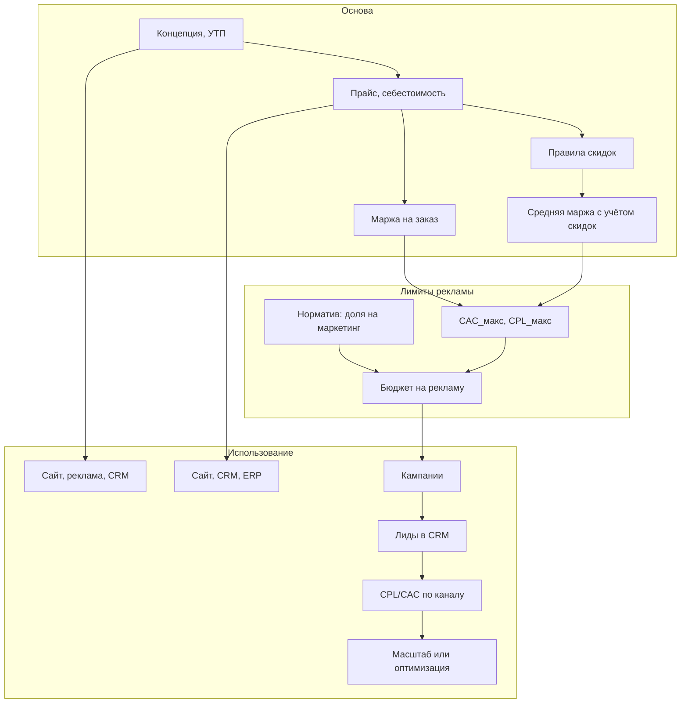

# Стратегия, УТП, скидки, зависимости и стандарты развития

> [← Главный план](main.md)

В этом разделе плана: позиционирование и УТП (где и как используются), этап и правила дисконтирования, связь расчёта рекламы с ценой и наценкой, нормативы на развитие и маркетинг, а также сводная карта зависимостей (что от чего зависит и где что применяется).

---

## 1. Позиционирование и УТП

### 1.1 Зачем фиксировать в плане

Без явного позиционирования и УТП (уникального торгового предложения) сложно единообразно подавать компанию на сайте, в рекламе и в переговорах. В крупных компаниях это оформляют в маркетинговый бриф; в плане достаточно зафиксировать формулировки и **места использования**.

### 1.2 Что определить


| Элемент              | Описание                                                                     | Пример для детейлинга                                                  |
| -------------------- | ---------------------------------------------------------------------------- | ---------------------------------------------------------------------- |
| **Целевой сегмент**  | Кто клиент (премиум / массовый рынок, частные / корпоративы, география); при необходимости разделение B2C и B2B — см. [Сегменты B2C и B2B](11-b2c-b2b-segments.md) | Владельцы авто премиум-сегмента в городе X; или B2B: автопарки, дилеры |
| **Позиционирование** | Как хотим, чтобы нас воспринимали (качество, скорость, цена, эксклюзив)      | «Детейлинг премиум-уровня без переплаты»                               |
| **УТП**              | Одна главная причина выбрать именно нас (оформленная в одно-два предложения) | «Керамика с гарантией 3 года и фиксированной ценой под ваш автомобиль» |
| **Доказательства**   | Что подкрепляет УТП (гарантии, сертификаты, отзывы, кейсы)                   | Гарантия на работы, фото до/после, рейтинг                             |


### 1.3 Где и как используются


| Где используется            | Для чего                                                                    | Этап плана                                                                                |
| --------------------------- | --------------------------------------------------------------------------- | ----------------------------------------------------------------------------------------- |
| **Сайт** (главная, «О нас») | Тексты, заголовки, блок «Почему мы»                                         | [Сайт](05-website.md)                                                                     |
| **Посадочные и реклама**    | Заголовки объявлений, тексты креативов, офферы                              | [Каналы и кампании](06-marketing-channels.md)                                             |
| **CRM и скрипты продаж**    | Как отвечать на возражения, как презентовать предложение при звонке/встрече | [CRM](03-crm.md)                                                                          |
| **КП и коммерция**          | Как обосновывать цену, что выделять в пакетах и акциях                      | [Услуги и прайс](02-services-pricing.md), [CRM](03-crm.md)                                |
| **Программа лояльности**    | Скидки повторным, баллы или уровни — в рамках лимитов и минимальной наценки | [CRM](03-crm.md), [Интеграция процессов и лояльность](15-business-process-integration.md) |


**Итог:** УТП и позиционирование задаются на этапе [концепции и основы](main.md), затем последовательно переносятся в сайт, рекламу, CRM и коммерческие предложения. Скрипты продаж и границы полномочий (например по скидкам) закрепляются в [должностных инструкциях](13-job-descriptions.md) ответственных сотрудников.

---

## 2. Этап и правила дисконтирования

### 2.1 Зачем отдельный этап в плане

Скидки влияют на маржу и на то, какой CAC ещё допустим. Если скидки не регламентированы, средний чек и маржа падают, а лимиты на рекламный бюджет (которые считаются от маржи) становятся неверными. В плане нужен **явный этап принятия правил скидок** и их привязка к [прайсу и марже](02-services-pricing.md).

### 2.2 Когда применять скидки (этап дисконтирования)


| Ситуация                       | Цель                    | Ограничение                                                                                       |
| ------------------------------ | ----------------------- | ------------------------------------------------------------------------------------------------- |
| Первый заказ (привлечение)     | Конверсия лида в заказ  | Лимит % или фикс. сумма; не ниже минимальной наценки (см. ниже)                                   |
| Пакеты (несколько услуг)       | Рост среднего чека      | Скидка только на пакет; себестоимость пакета известна из [карточек услуг](02-services-pricing.md) |
| Сезонные акции                 | Нагрузка в низкий сезон | Ограниченный срок; цена не ниже себестоимости + доля постоянных                                   |
| Повторные клиенты / лояльность | Удержание, LTV          | Персональная скидка в рамках утверждённого лимита                                                 |
| Крупный заказ / корпоратив     | Объём                   | Отдельный расчёт; маржа не ниже целевой (например 25–30%)                                         |


**Этап в плане:** правила скидок принимаются после утверждения [прайса и себестоимости](02-services-pricing.md), до массового запуска рекламы и акций. Менеджеры и владелец действуют по одному регламенту.

### 2.3 Минимальная наценка и «пол» для скидки

- По каждой услуге известна **себестоимость** (из [карточки услуги](02-services-pricing.md)).
- Задаёте **минимальную целевую маржу** (например 25% от цены или X € с заказа).
- **Минимальная допустимая цена** = себестоимость / (1 − минимальная доля маржи) или: себестоимость + минимальная маржа в €.
- Любая скидка не должна вести цену ниже этого порога. Исключения (например стратегический первый заказ) — явно прописаны и ограничены по объёму.

### 2.4 Связь с рекламой и CAC

Чем больше скидки, тем ниже фактическая маржа с заказа → ниже допустимый CAC (см. [расчёт рекламных кампаний](06-marketing-channels.md)). При планировании бюджета на рекламу используйте **среднюю ожидаемую маржу с учётом типовых скидок**, а не только «полную» цену из прайса.

---

## 3. Зависимости расчёта рекламы от цены и наценки

### 3.1 Цепочка зависимостей

```
Цена и наценка → Маржа на заказ → Макс. допустимый CAC → Макс. допустимый CPL
       → Бюджет на рекламу и масштаб кампаний
```

- **Цена продажи** и **себестоимость** задают **маржа на заказ** (€ и %).  
См. [себестоимость и прайс](02-services-pricing.md).
- **Маржа на заказ** и **доля, которую готовы отдать на привлечение** (например 20–30%) задают **максимально допустимый CAC**.
- **CAC_макс** и **конверсия лид → заказ** задают **максимально допустимый CPL** (стоимость лида).
- **CPL_макс** и **целевое число лидов** задают **необходимый бюджет на рекламу**.
- **Фактический CPL** по каналу (из [аналитики и CRM](07-analytics-and-tools.md)) определяет, можно ли масштабировать канал при заданном бюджете.

### 3.2 Формулы зависимостей


| Связь                   | Формула                                                                                                             |
| ----------------------- | ------------------------------------------------------------------------------------------------------------------- |
| Маржа на заказ (€)      | Цена продажи − Себестоимость                                                                                        |
| Маржа на заказ (%)      | (Цена − Себестоимость) / Цена × 100                                                                                 |
| CAC_макс (ориентир)     | Маржа на заказ × Доля на привлечение (например 0,25–0,30)                                                           |
| CPL_макс                | CAC_макс / Конверсия_лид→заказ (например 0,20–0,30)                                                                 |
| Бюджет на рекламу (мес) | Целевое кол-во лидов × Ожидаемый CPL по каналу                                                                      |
| Масштабирование         | Если факт. CPL < CPL_макс → можно увеличивать бюджет; если факт. CPL > CPL_макс → оптимизировать или снижать бюджет |


### 3.3 Влияние наценки на рекламу

- **Выше наценка** при той же цене (ниже себестоимость) → выше маржа → выше допустимый CAC и CPL → можно позволить более дорогие каналы или больший бюджет при том же числе лидов.
- **Ниже наценка** (или большие скидки) → ниже маржа → ниже допустимый CAC/CPL → реклама должна быть дешевле по лиду или конверсия выше (лучший оффер, лендинг, скрипты).

В плане: сначала фиксируем [прайс и себестоимость](02-services-pricing.md), затем [правила скидок](#2-этап-и-правила-дисконтирования), затем считаем [лимиты CAC/CPL и бюджет](06-marketing-channels.md).

---

## 4. Стандарты на развитие и маркетинг

### 4.1 Зачем нормативы

Чтобы развитие и маркетинг были предсказуемыми и не «съедали» всю маржу, в плане задают **нормативы**: какую долю выручки или прибыли направлять на маркетинг, на инструменты и на развитие. Так же делают в крупных компаниях (доля маркетинга от выручки, бюджет на IT и т.д.).

### 4.2 Нормативы (ориентиры для плана)


| Статья                                        | Ориентир                                          | Назначение                                                                       |
| --------------------------------------------- | ------------------------------------------------- | -------------------------------------------------------------------------------- |
| **Маркетинг (реклама)**                       | 5–15% от выручки или фикс. бюджет на месяц        | Рекламные кампании; не путать с единоразовыми затратами на сайт/бренд            |
| **Инструменты (CRM, аналитика, коллтрекинг)** | 1–3% от выручки или фикс. абонентские расходы     | Поддержка [CRM](03-crm.md), [аналитики](07-analytics-and-tools.md), коллтрекинга |
| **Развитие (сайт, контент, обучение)**        | Отдельная строка в постоянных или разовые проекты | Апгрейд [сайта](05-website.md), контент, обучение менеджеров                     |
| **Доля маржи на привлечение**                 | 20–30% маржи с заказа — допустимо тратить на CAC  | Верхняя граница того, сколько «можно» платить за нового клиента                  |


Эти нормативы используются при составлении [постоянных расходов](02-services-pricing.md) и при планировании [рекламного бюджета](06-marketing-channels.md).

### 4.3 Когда пересматривать

- При изменении цен или себестоимости — пересчёт маржи, CAC_макс, CPL_макс и допустимого бюджета.
- При выходе на новый этап (рост, масштаб) — пересмотр доли на маркетинг и на инструменты (часто доля на маркетинг растёт при масштабировании).
- При введении новых правил скидок — пересчёт средней маржи и лимитов на рекламу.

---

## 5. Карта зависимостей: что для чего делается и где используется

Ниже — сводная таблица: какие элементы плана от чего зависят и где применяются. Это даёт единую картину, как в крупной компании: один источник правды по цене/марже/УТП, и везде согласованное использование.

### 5.1 Зависимости «откуда что берётся»


| Что                    | Откуда берётся                                                                     | Где используется                                                                                    |
| ---------------------- | ---------------------------------------------------------------------------------- | --------------------------------------------------------------------------------------------------- |
| Себестоимость услуги   | [Карточки услуг](02-services-pricing.md), постоянные расходы, нормы материалов     | Прайс, минимальная цена скидки, [ERP](04-erp-inventory.md) (списание), расчёт маржи                 |
| Цена продажи           | Прайс (на основе себестоимости и целевой маржи)                                    | Сайт, реклама, КП в [CRM](03-crm.md), расчёт среднего чека и маржи                                  |
| Маржа на заказ         | Цена − Себестоимость (по услуге или средняя по заказам)                            | [CAC_макс, CPL_макс](06-marketing-channels.md), норматив «доля на привлечение»                      |
| УТП и позиционирование | Этап [концепции](main.md)                                                          | [Сайт](05-website.md), тексты рекламы, скрипты в [CRM](03-crm.md), КП                               |
| Правила скидок         | [Этап дисконтирования](#2-этап-и-правила-дисконтирования) (после прайса)           | Менеджеры, акции, пакеты; пересчёт средней маржи для рекламы                                        |
| Источник лида          | Сайт (UTM), [коллтрекинг](07-analytics-and-tools.md)                               | [CRM](03-crm.md) → отчёты CPL/CAC, [аналитика](07-analytics-and-tools.md)                           |
| Бюджет на рекламу      | [Норматив](#4-стандарты-на-развитие-и-маркетинг) или расчёт от целевых лидов и CPL | [Каналы](06-marketing-channels.md), рекламные кабинеты; учёт в постоянных расходах при планировании |


### 5.2 По этапам плана: что на каком этапе делается и зачем


| Этап плана                       | Что делается                                                   | Для чего (где используется дальше)                                       |
| -------------------------------- | -------------------------------------------------------------- | ------------------------------------------------------------------------ |
| Концепция, позиционирование, УТП | Формулировки ЦА, позиции, УТП, доказательств                   | Сайт, реклама, CRM-скрипты, КП; единый месседж                           |
| Услуги и себестоимость           | Карточки услуг, прайс, точка безубыточности                    | ERP, сайт, CRM (каталог услуг), расчёт маржи и лимитов на рекламу        |
| Правила скидок                   | Лимиты, минимальная наценка, типы акций                        | Менеджеры, акции; корректная средняя маржа для CAC/CPL                   |
| CRM                              | Воронка, поля, источник лида                                   | Учёт лидов и сделок, отчёты CPL/CAC, интеграция с сайтом и коллтрекингом |
| Сайт                             | Тексты (УТП), цены (прайс), форма, UTM                         | Лиды в CRM, реклама ведёт на сайт, аналитика целей                       |
| Аналитика и коллтрекинг          | Цели, источники, звонки → CRM                                  | Корректный CPL/CAC по каналам, оптимизация рекламы                       |
| Рекламные кампании               | Бюджет (от маржи и нормативов), CPL/CAC-лимиты, креативы (УТП) | Лиды с известным источником; масштабирование при CPL < CPL_макс          |
| Нормативы на развитие            | Доля выручки на маркетинг, на инструменты                      | Планирование постоянных расходов и рекламного бюджета                    |


### 5.3 Схема зависимостей




---

## 6. Связь с остальными разделами плана

- [Услуги и прайс](02-services-pricing.md) — источник себестоимости, цены и маржи; от них считаются лимиты на рекламу и минимальные цены при скидках.
- [CRM](03-crm.md) — место использования УТП в скриптах; источник лида для CPL/CAC.
- [Сайт](05-website.md) — размещение УТП и цен; форма и UTM для атрибуции.
- [Каналы и рекламные кампании](06-marketing-channels.md) — расчёт бюджета и CPL/CAC от маржи; креативы на основе УТП.
- [Аналитика и коллтрекинг](07-analytics-and-tools.md) — фактические CPL и конверсии по каналам для решений о масштабе.
- [Главный план](main.md) — этапы внедрения; этап дисконтирования и нормативы встроены в общую последовательность.

