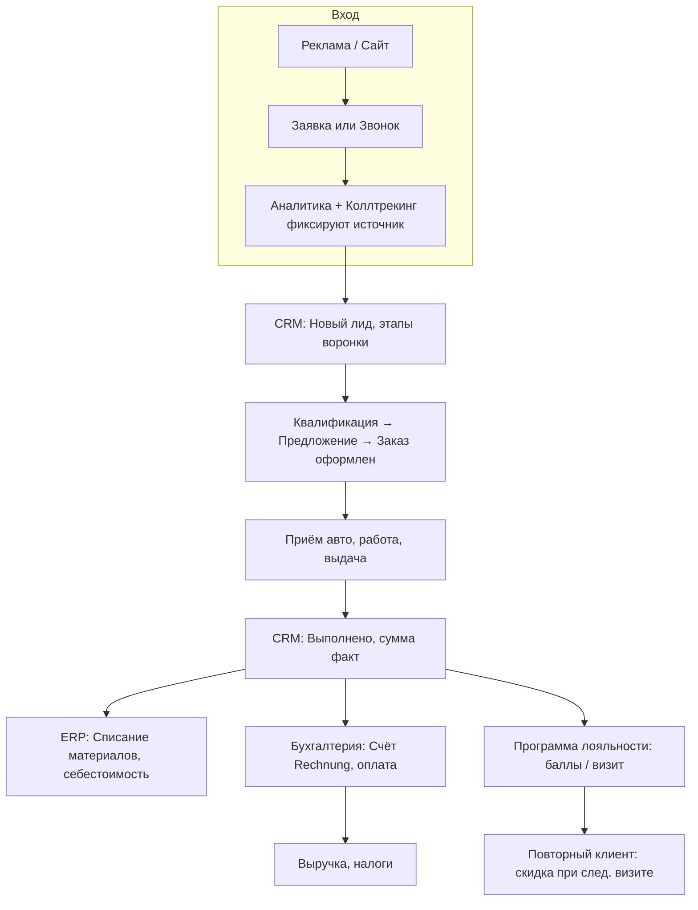

# Интеграция бизнес-процессов: CRM, ERP, бухгалтерия, программа лояльности

> [← Главный план](main.md)

В этом разделе: **зачем описывать бизнес-процессы**, **полная интеграция** CRM ↔ ERP ↔ бухгалтерия по циклу продажи услуги, **программа лояльности** и точки её интеграции, **один сквозной пример** процесса от лида до оплаты с участием сайта, аналитики, коллтрекинга, CRM, ERP, бухгалтерии и лояльности.

---

## 1. Зачем описывать бизнес-процессы

**Описание бизнес-процесса** — это пошаговая фиксация: кто что делает, в какой системе, в каком порядке и какие данные передаются между системами. Зачем это нужно:

- **Единое понимание:** команда и подрядчики видят полный поток от заявки до денег и документов.
- **Интеграции:** понятно, какие данные из CRM должны уходить в ERP и бухгалтерию, и наоборот.
- **Онбординг и SOP:** новый сотрудник или замена может опереться на описание (см. [SOP в 14](14-business-process-optimization.md)).
- **Контроль и аудит:** проще проверить, что счёт выставляется по сделке из CRM, а списание в ERP — по закрытому заказу.

Ниже — один полный пример процесса и схема связки CRM–ERP–бухгалтерия–лояльность.

---

<a id="2-связка-crm-erp-бухгалтерия"></a>
## 2. Связка CRM ↔ ERP ↔ Бухгалтерия

### 2.1 Роли систем

| Система | Что ведёт | Что отдаёт другим |
|---------|-----------|--------------------|
| **CRM** | Лиды, сделки, этапы воронки, сумма (план/факт), клиент, источник, даты визита и закрытия | При закрытии сделки: сумма к оплате, перечень услуг, клиент → для счёта (бухгалтерия); код/набор услуг и кол-во → для списания материалов (ERP). |
| **ERP** | Остатки материалов, нормы на услуги (BOM), приход/расход, себестоимость заказа (материалы + труд по ролям) | При закрытии заказа из CRM: списание по нормам; себестоимость заказа → для отчётности по марже и при необходимости для бухгалтерии (учёт затрат). |
| **Бухгалтерия** | Счета (Rechnung), учёт оплат, налоги (USt.), отчётность; при необходимости — учёт затрат по заказам | Выручка по периодам, факт оплат → для отчётов в CRM/дашбордах; номера и даты счетов → при желании обратно в CRM. |

### 2.2 Поток данных по циклу продажи услуги

```
Лид (сайт/реклама/звонок) → CRM: новая сделка, источник
     ↓
Квалификация, КП → CRM: этап «Предложение», сумма (план)
     ↓
Запись на визит → CRM: этап «Заказ оформлен»
     ↓
Приём авто, работа → CRM: «В работе»; при выдаче — оплата
     ↓
Закрытие сделки → CRM: этап «Выполнено», сумма (факт)
     ↓
Триггер 1: CRM → ERP — списать материалы по нормам по услугам сделки
Триггер 2: CRM (или бухгалтерия) → Счёт (Rechnung): сумма, клиент, услуги, НДС
     ↓
Оплата → Бухгалтерия: фиксация оплаты; при интеграции — обновление «Оплачено» в CRM
     ↓
Опционально: CRM → Программа лояльности — начисление баллов / учёт визита для скидки повторным
```

**Практика:** счёт может выставляться из бухгалтерского модуля/программы по данным из CRM (экспорт закрытых сделок) или вручную по данным из CRM. Выручка и счета ведутся в учётной программе или у бухгалтера; CRM остаётся источником «что продали и кому» для передачи в бухгалтерию.

---

## 3. Пример одного бизнес-процесса: «Продажа услуги от лида до оплаты»

Ниже — **один сквозной процесс** с точками участия всех перечисленных систем. Его можно использовать как эталон для описания и настройки интеграций.

### 3.1 Участники и системы

| Участник / система | Роль в процессе |
|--------------------|------------------|
| **Сайт** | Показ услуг и цен, форма заявки или кнопка «Позвонить»; передача UTM/источника. |
| **Реклама** | Трафик на сайт (Google Ads, Meta и др.) с UTM. |
| **Аналитика** | Фиксация визита, отправки формы, клика по телефону; источник в отчётах. |
| **Коллтрекинг** | Подмена номера на сайте; при звонке — фиксация источника и при необходимости создание лида в CRM. |
| **CRM** | Воронка: лид → квалификация → предложение → заказ оформлен → выполнен; хранение суммы, клиента, источника, дат. |
| **ERP** | Списание материалов по заказу после закрытия сделки в CRM; себестоимость заказа. |
| **Бухгалтерия** | Выставление счёта (Rechnung), учёт оплаты, НДС. |
| **Программа лояльности** | После закрытия сделки: начисление баллов или учёт визита для скидки повторному клиенту (правила в [08](08-strategy-discounts-dependencies.md)). |

### 3.2 Пошаговый сценарий (один заказ)

| Шаг | Действие | Система | Данные / интеграция |
|-----|-----------|---------|----------------------|
| 1 | Клиент переходит на сайт по рекламе (UTM в URL) | Сайт, Аналитика | Визит, источник (utm_source, campaign) сохраняются в аналитике и в cookie для коллтрекинга. |
| 2 | Клиент оставляет заявку (форма) или звонит по номеру на сайте | Сайт, Форма / Коллтрекинг | Форма: отправка в CRM с UTM/источником. Звонок: коллтрекинг создаёт лид в CRM с источником или привязывает к существующему. |
| 3 | В CRM создаётся лид/сделка с источником | CRM | Поля: контакт, авто, желаемая услуга, **источник** (Google Ads, Meta, сайт и т.д.). |
| 4 | Менеджер звонит, уточняет объём, направляет КП | CRM | Этап «Квалификация» → «Предложение»; сумма (план) из прайса, при повторном клиенте — учёт [скидки лояльности](08-strategy-discounts-dependencies.md). |
| 5 | Клиент согласен, записан на визит | CRM | Этап «Заказ оформлен»; дата визита. |
| 6 | В день визита: приём авто, осмотр, подпись | CRM, документы | Сделка в работе; акт/подпись о приёмке — по [операционному циклу](03-crm.md). |
| 7 | Выполнение работ | ERP (нормы) | Мастера работают по заказу; списание материалов — после закрытия (шаг 9). |
| 8 | Выдача авто, подпись о приёмке работ, оплата клиентом | CRM, Бухгалтерия | Сумма (факт) вносится в CRM; при необходимости выдан чек или счёт на месте (бухгалтерия/шаблон). |
| 9 | Сделка переводится в «Выполнено» | CRM | Закрытие сделки. |
| 10 | Триггер: списание материалов по заказу | CRM → ERP | Передача в ERP: код сделки/заказа, перечень услуг (код + кол-во); ERP списывает по BOM, считает себестоимость заказа. |
| 11 | Счёт (Rechnung) выставляется клиенту | Бухгалтерия | Данные из CRM (клиент, сумма, услуги) или ручной ввод; номер счёта, срок оплаты; при оплате на месте — факт оплаты в бухгалтерии. |
| 12 | Оплата зафиксирована | Бухгалтерия | Выручка учтена; при интеграции бухгалтерия → CRM можно обновить статус «Оплачено» в сделке. |
| 13 | Начисление баллов / учёт для лояльности | CRM, Программа лояльности | В карточке клиента: +1 визит или начисление баллов; при следующем обращении — применение скидки повторного в рамках [правил скидок](08-strategy-discounts-dependencies.md). |

### 3.3 Схема процесса (Mermaid)



---

<a id="4-программа-лояльности-что-это-и-где-интегрировать"></a>
## 4. Программа лояльности: что это и где интегрировать

### 4.1 Зачем

- Рост LTV и доли повторных клиентов; снижение эффективного CAC за счёт удержания.
- Чёткие правила скидок для «своих» клиентов в рамках [регламента скидок](08-strategy-discounts-dependencies.md).

### 4.2 Варианты реализации

| Вариант | Описание | Где вести |
|---------|----------|-----------|
| **Простой: скидка повторным** | Второй и последующие визиты — фиксированная скидка (например 5–10%) или скидка на N-й заказ. | [CRM](03-crm.md): в карточке клиента — количество визитов или метка «повторный»; при создании КП менеджер применяет скидку по [правилам](08-strategy-discounts-dependencies.md). |
| **Баллы** | За каждый заказ начисляются баллы; баллы обмениваются на скидку или бесплатную услугу. | CRM: поле «Баллы» у клиента; при закрытии сделки — начисление по правилу (например 1 € заказа = 1 балл, 100 баллов = 5 € скидки). Либо отдельный модуль/таблица. |
| **Уровни (Silver/Gold)** | В зависимости от суммы заказов или числа визитов — уровень с разным % скидки. | CRM: поле «Уровень» или «Тип клиента»; при достижении порога обновляется вручную или по правилу. КП и прайс учитывают скидку уровня. |

### 4.3 Точки интеграции программы лояльности

| Где | Как интегрировать |
|-----|--------------------|
| **CRM** | В карточке клиента: количество визитов, баллы, уровень; при закрытии сделки «Выполнено» — автоматическое или ручное начисление баллов / учёт визита. Напоминание о повторном визите (задача через N месяцев) — уже в [09 retention](09-marketing-seo-extensions.md). |
| **Правила скидок** | Скидка для «повторных» или по баллам должна быть в рамках [минимальной наценки и лимитов](08-strategy-discounts-dependencies.md). |
| **Сайт** | Блок «Программа лояльности» или «Скидка постоянным клиентам»; при личном кабинете — отображение баллов (если реализовано). |
| **Колл-центр / приём заявок** | Менеджер при создании КП проверяет в CRM: повторный ли клиент, баллы/уровень — и применяет соответствующую скидку. |
| **Бухгалтерия** | Скидка по программе лояльности отражается в сумме счёта (Rechnung) как обычная скидка; отдельная проводка не обязательна, если итоговая выручка и НДС считаются верно. |

### 4.4 Когда внедрять

- **Минимум:** сразу можно завести в CRM поле «Количество визитов» или метку «Повторный» и применять простую скидку по [регламенту](08-strategy-discounts-dependencies.md).
- **Баллы и уровни:** после стабилизации потока заказов и при желании стимулировать повторные визиты; описание правил начисления и списания зафиксировать в том же регламенте скидок или в отдельном одностраничном регламенте.

Подробнее про удержание и повторные продажи: [09, раздел 1.5](09-marketing-seo-extensions.md).

---

## 5. Бухгалтерская часть: минимум для интеграции с процессами продажи

### 5.1 Что должно приходить из бизнес-процесса в бухгалтерию

| Данные | Откуда | Назначение |
|--------|--------|------------|
| **Факт оказания услуги и сумма** | CRM (сделка «Выполнено», сумма факт) или первичные документы (акт, заказ) | Основание для выставления счёта (Rechnung). |
| **Клиент (реквизиты)** | CRM (карточка клиента) | Плательщик в счёте. |
| **Состав услуг** | CRM (перечень услуг по сделке) | Расшифровка в Rechnung. |
| **Себестоимость заказа (опционально)** | ERP | Внутренняя отчётность по марже; при необходимости учёт затрат по заказу. |

### 5.2 Типовой поток документов

1. **До оказания услуги:** договор/оферта при необходимости ([12](12-legal-checklist-de.md)).
2. **При приёме авто:** акт/подпись о приёмке ([03](03-crm.md)).
3. **При выдаче и оплате:** подпись о приёмке работ; выдача счёта (Rechnung) с НДС при необходимости; оплата (наличные, карта, перевод).
4. **В бухгалтерии:** регистрация выручки, НДС, хранение копий счетов и первичных документов по требованиям налогового права.

Интеграция «CRM → бухгалтерия» может быть ручной (экспорт закрытых сделок раз в день/неделю + ввод счетов) или автоматической (API/файловый обмен между CRM и учётной программой или Steuerberater).

---

## 6. Зависимости этапов внедрения и перелинковка

Чтобы интеграция CRM–ERP–бухгалтерия и программа лояльности работали по описанному процессу:

| Этап плана (main) | Что должно быть готово для полной интеграции |
|-------------------|-----------------------------------------------|
| Услуги и цены (2) | Прайс и [карточки услуг](02-services-pricing.md) — для КП в CRM и для BOM в ERP. |
| Правила скидок (3) | [Регламент скидок](08-strategy-discounts-dependencies.md) — для скидок повторным и по программе лояльности. |
| Юрлицо (4) | [Документы и счета](12-legal-checklist-de.md) — кто выставляет Rechnung, где хранятся копии. |
| CRM (6) | Воронка, поля (источник, сумма план/факт), [операционный цикл](03-crm.md); при лояльности — поля «визиты»/«баллы»/«уровень» у клиента. |
| Сайт (7) | Форма → CRM с источником; при лояльности — блок о программе на сайте. |
| ERP (8) | [Справочники и BOM](04-erp-inventory.md); при интеграции с CRM — приём кода заказа и перечня услуг для списания. |
| Аналитика и коллтрекинг (9) | [Источник в CRM](07-analytics-and-tools.md) для каждого лида (форма + звонки). |
| Продвижение (10) | Запуск рекламы с UTM и учётом лидов в CRM. |
| Оптимизация (11) | [SOP и процедуры](14-business-process-optimization.md) могут включать описание этого процесса; дашборд по выручке/марже использует данные CRM и при необходимости ERP/бухгалтерии. |

**Дополнительный этап в таблице внедрения (main):** после стабилизации CRM и первых заказов — явный шаг «Интеграция с бухгалтерией и программа лояльности»: решить, как передаются данные из CRM в бухгалтерию (счета), настроить списание в ERP по закрытым сделкам, ввести правила лояльности в CRM и в регламент скидок. См. [main, раздел 7](main.md).

---

## 7. Связь с остальными разделами плана

| Раздел | Связь |
|--------|--------|
| [main](main.md) | Раздел 15 в оглавлении; этап внедрения «Бухгалтерия и лояльность»; обновлённая карта зависимостей. |
| [02](02-services-pricing.md) | Прайс и карточки услуг — основа для КП в CRM и для BOM в ERP. |
| [03](03-crm.md) | Воронка, операционный цикл, документы; интеграция с ERP и бухгалтерией; поля клиента для лояльности. |
| [04](04-erp-inventory.md) | Списание по заказу из CRM; себестоимость заказа для маржи и при необходимости для бухгалтерии. |
| [05](05-website.md) | Форма и источник; при лояльности — контент о программе на сайте. |
| [06](06-marketing-channels.md) | Источник лида в CRM для CPL/CAC; реклама ведёт на сайт. |
| [07](07-analytics-and-tools.md) | Аналитика и коллтрекинг фиксируют источник; данные для атрибуции. |
| [08](08-strategy-discounts-dependencies.md) | Правила скидок включают скидки повторным и по программе лояльности; минимальная наценка. |
| [09](09-marketing-seo-extensions.md) | Retention и программа лояльности; напоминания о повторном визите. |
| [10](10-metrics-and-kpis.md) | LTV, доля повторных — метрики, которые поддерживаются программой лояльности. |
| [12](12-legal-checklist-de.md) | Документы при оказании услуги, счёт Rechnung, хранение. |
| [14](14-business-process-optimization.md) | SOP и описание процедур могут ссылаться на этот сквозной процесс. |
