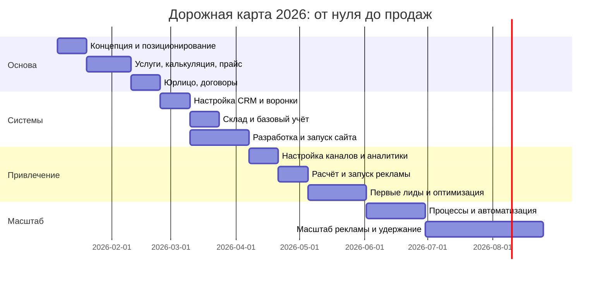
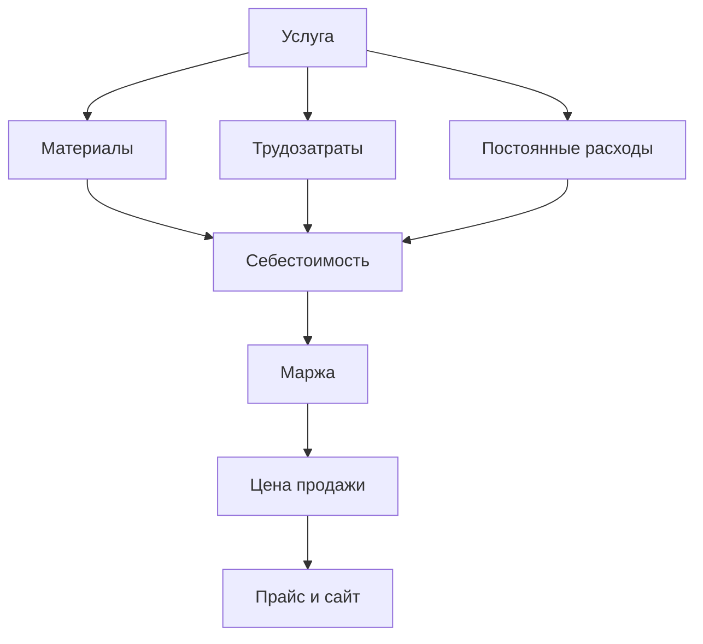
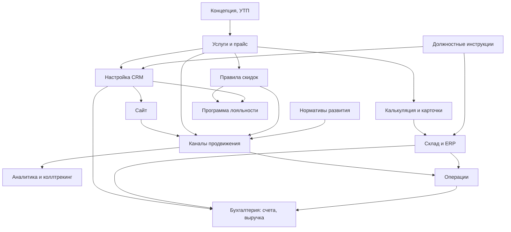

# План реализации детейлинга: от нуля до продажи

> Полный цикл запуска и масштабирования бизнеса детейлинга: все суммы в **EUR**. От расчёта себестоимости услуг и карточек до внедрения рекламных кампаний, сквозной аналитики и выбора программного обеспечения.

---

## Оглавление (навигация)

| Раздел                                                                                                                  | Описание                                                                                                                               |
| ----------------------------------------------------------------------------------------------------------------------- | -------------------------------------------------------------------------------------------------------------------------------------- |
| [1. Глобальная дорожная карта](#1-глобальная-дорожная-карта)                                                            | Этапы от идеи до стабильных продаж, таймлайн 2026                                                                                      |
| [2. Услуги и себестоимость](#2-услуги-и-себестоимость)                                                                  | Каталог, карточки услуг, калькуляция в EUR, прайс                                                                                      |
| [3. CRM и учёт](#3-crm-и-учёт)                                                                                          | Воронка продаж, клиенты, задачи, интеграции                                                                                            |
| [4. ERP и склад](#4-erp-и-склад)                                                                                        | Запасы, закупки, себестоимость заказов                                                                                                 |
| [5. Сайт и цифровое присутствие](#5-сайт-и-цифровое-присутствие)                                                        | Структура, контент, интеграции                                                                                                         |
| [6. Каналы продвижения](#6-каналы-продвижения)                                                                          | Каналы, стратегии, расчёт кампаний, внедрение                                                                                          |
| [7. Бизнес-процессы и этапы внедрения](#7-бизнес-процессы-и-этапы-внедрения)                                            | Что внедрять и в каком порядке                                                                                                         |
| [8. Сквозная аналитика, коллтрекинг и ПО](#8-сквозная-аналитика-коллтрекинг-и-по)                                       | Аналитика, коллтрекинг, перечень программ                                                                                              |
| [9. Стратегия, УТП, скидки, зависимости и стандарты развития](#9-стратегия-утп-скидки-зависимости-и-стандарты-развития) | Позиционирование, УТП, этап дисконтирования, связь рекламы с ценой/наценкой, нормативы, карта зависимостей                             |
| [10. Рекомендации по расширению плана](#10-рекомендации-по-расширению-плана)                                            | Доп. этапы (конкуренты, локальное SEO, контент, отзывы, retention, аудит), инструменты SEO/маркетинга, процессы и команда              |
| [11. Метрики, отчётность и полнота плана](#11-метрики-отчётность-и-полнота-плана)                                       | Какие метрики считать, когда и откуда данные; unit economics; ритм отчётов; риски; чек-лист перед запуском; бюджет по фазам            |
| [12. Чек-лист: юрлицо и регламенты](#12-чек-лист-юрлицо-и-регламенты)                                                             | Регистрация, договоры, персональные данные, страхование, документы при оказании услуги                                                 |
| [13. Должностные инструкции](#13-должностные-инструкции)                                                                | Роли, обязанности, полномочия; связь с CRM, ERP, УТП и скриптами; при найме                                                             |
| [14. Оптимизация бизнес-процессов](#14-оптимизация-бизнес-процессов)                                                    | SLA, качество, рекламации, эскалации, непрерывность, SOP, база знаний, аудит, поставщики, онбординг, доступы, дашборд, версионирование |
| [15. Интеграция бизнес-процессов](#15-интеграция-бизнес-процессов)                                                      | CRM–ERP–бухгалтерия, программа лояльности, пример сквозного процесса от лида до оплаты, перелинковка этапов                            |

---

## Карта файлов плана (навигация)

| Файл                                      | За что отвечает                                                                                                                     | Когда использовать                                                |
| ----------------------------------------- | ----------------------------------------------------------------------------------------------------------------------------------- | ----------------------------------------------------------------- |
| **main.md**                               | Дорожная карта, этапы, связи между разделами                                                                                        | Старт; решения по очередности                                     |
| **02-services-pricing.md**                | Услуги, себестоимость, прайс, точка безубыточности                                                                                  | Фаза «Основа»; пересчёт при изменении цен                         |
| **03-crm.md**                             | Воронка, поля, интеграции, операционный цикл                                                                                        | Фаза «Системы» и далее                                            |
| **04-erp-inventory.md**                   | Склад, нормы, списание                                                                                                              | После стабилизации заказов                                        |
| **05-website.md**                         | Сайт, форма, SEO, правовые страницы                                                                                                 | Фаза «Системы»; перед рекламой                                    |
| **06-marketing-channels.md**              | Каналы, расчёт кампаний, запуск                                                                                                     | Фаза «Привлечение»                                                |
| **07-analytics-and-tools.md**             | Аналитика, коллтрекинг, перечень ПО                                                                                                 | Перед рекламой и постоянно                                        |
| **08-strategy-discounts-dependencies.md** | УТП, скидки, зависимости, нормативы                                                                                                 | Концепция; при изменении цен/скидок                               |
| **09-marketing-seo-extensions.md**        | Расширения: конкуренты, SEO, контент, отзывы, retention                                                                             | После основы                                                      |
| **10-metrics-and-kpis.md**                | Метрики, отчётность, GTM-чек-лист, риски, план Б, бюджет по фазам                                                                   | Перед запуском рекламы; еженедельно/ежемесячно                    |
| **11-b2c-b2b-segments.md**                | Определение B2C/B2B; что меняется в прайсе, сайте, CRM, документах и рекламе при работе с разными сегментами                        | Этап «Концепция»; при решении работать с B2B или обоими сегментами |
| **12-legal-checklist-de.md**              | Чек-лист: юрлицо и регламенты — регистрация, договоры, данные, страхование, документы                                               | Этап «Юрлицо и регламенты» (этап 4)                               |
| **13-job-descriptions.md**                | Должностные инструкции: роли, обязанности, шаблон, связь с CRM/ERP/УТП                                                              | При формировании команды и найме                                  |
| **14-business-process-optimization.md**   | Оптимизация процессов (SLA, качество, рекламации, эскалации, BCP, SOP, база знаний, аудит, поставщики, онбординг, доступы, дашборд) | Фаза «Масштаб» и оптимизация; по мере роста                       |
| **15-business-process-integration.md**    | Интеграция CRM–ERP–бухгалтерия, программа лояльности, описание и пример сквозного бизнес-процесса продажи услуги                    | После стабилизации CRM и первых заказов; при внедрении лояльности |

---

## 1. Глобальная дорожная карта

Четыре фазы от «ничего нет» до стабильных продаж. Каждая фаза опирается на предыдущую. Ориентир по срокам — **2026**.

```mermaid
flowchart LR
    subgraph F1[Фаза 1: Основа]
        A1[Концепция и позиционирование]
        A2[Услуги и цены]
        A3[Юрлицо и регламенты]
    end
    subgraph F2[Фаза 2: Системы]
        B1[CRM]
        B2[ERP / Склад]
        B3[Сайт]
    end
    subgraph F3[Фаза 3: Привлечение]
        C1[Каналы и кампании]
        C2[Лендинги и реклама]
        C3[Первые лиды]
    end
    subgraph F4[Фаза 4: Масштаб]
        D1[Оптимизация процессов]
        D2[Масштабирование рекламы]
        D3[Продажи и удержание]
    end
    F1 --> F2 --> F3 --> F4
```

**Временная шкала 2026 (ориентир):**

**С чего начать глобально:** [концепция и позиционирование](#1-глобальная-дорожная-карта) → [услуги и себестоимость](#2-услуги-и-себестоимость) (в т.ч. [карточки услуг](02-services-pricing.md) и пошаговый расчёт) → [CRM](03-crm.md) → [сайт](05-website.md) → [каналы и рекламные кампании](06-marketing-channels.md) → [сквозная аналитика и ПО](07-analytics-and-tools.md). Детальный порядок — в [разделе 7](#7-бизнес-процессы-и-этапы-внедрения).

---

## 2. Услуги и себестоимость

### 2.1 Зачем это нужно

- Понятный каталог для клиента и для сайта.
- Расчёт маржи и точки безубыточности.
- Основа для прайса, акций и пакетов.
- База для ERP: нормы расхода материалов на услугу.
- Выбор сегмента (только B2C, только B2B или оба) влияет на структуру прайса и каталога; см. [Сегменты B2C и B2B](11-b2c-b2b-segments.md).

### 2.2 Структура каталога (пример)

| Группа            | Примеры услуг                                 | Связь                                                       |
| ----------------- | --------------------------------------------- | ----------------------------------------------------------- |
| **Экстерьер**     | Мойка, полировка, керамика, защита ЛКП        | [Прайс](02-services-pricing.md), [ERP](04-erp-inventory.md) |
| **Интерьер**      | Химчистка салона, уход за кожей, озонирование | [CRM](03-crm.md), [Сайт](05-website.md)                     |
| **Дополнительно** | Оклейка, тонировка, моторный отсек            | [Каналы](06-marketing-channels.md)                          |

Детально: **[Услуги и прайс](02-services-pricing.md)** — каталог в EUR, карточки услуг, пошаговая калькуляция себестоимости, примеры расчёта.

### 2.3 Формула себестоимости (EUR)

**Себестоимость услуги (€) = Материалы (€) + (Время (ч) × Ставка (€/ч)) + Доля постоянных расходов (€).**

Минимальная цена продажи — выше себестоимости; целевая — с плановой маржой (рекомендуется 40–60%). Цены указывают с НДС по применимой ставке, если вы плательщик НДС.

---

## 3. CRM и учёт

- Единая воронка: заявка → квалификация → предложение → визит → выполнение → повтор.
- Учёт клиентов, машин, истории заказов.
- Отчёты: конверсия, средний чек (EUR), LTV, источник лида.

Подробно: **[CRM и воронка](03-crm.md)** — этапы, поля, интеграции с сайтом, рекламой и [коллтрекингом](07-analytics-and-tools.md).

---

## 4. ERP и склад

- Учёт остатков, нормы расхода на услугу, списание по заказам, закупки.
- Себестоимость заказа в EUR для отчётности и маржи.

Подробно: **[ERP и склад](04-erp-inventory.md)** — справочник материалов, карточки услуг с нормами, порядок списания.

---

## 5. Сайт и цифровое присутствие

- Представление услуг и цен (EUR), приём заявок → CRM, доверие (фото, отзывы), SEO и контекст.

Подробно: **[Сайт](05-website.md)** — структура, форма заявки, аналитика, правовые страницы (импрессум, защита данных).

---

## 6. Каналы продвижения

- Выбор каналов и стратегий, расчёт рекламных кампаний (бюджет EUR, CPL/CAC), план внедрения.
- Связь с [сквозной аналитикой](07-analytics-and-tools.md) и [коллтрекингом](07-analytics-and-tools.md).

Подробно: **[Каналы и рекламные кампании](06-marketing-channels.md)** — стратегии, выбор каналов, формулы расчёта, план запуска и оптимизации.

---

## 7. Бизнес-процессы и этапы внедрения

### 7.1 Карта зависимостей

### 7.2 Пошаговый порядок внедрения (2026)

| №   | Этап                                            | Действия                                                                                                                                                                                                                                                                                                              | Ссылки                                                                                                                            |
| --- | ----------------------------------------------- | --------------------------------------------------------------------------------------------------------------------------------------------------------------------------------------------------------------------------------------------------------------------------------------------------------------------- | --------------------------------------------------------------------------------------------------------------------------------- |
| 0   | **Валидация и локация** (при необходимости)     | Проверка спроса в выбранном районе (конкуренты, объёмы, цены); критерии по точке: видимость, парковка для клиентов, подвод коммуникаций; при аренде — сроки и условия. Можно делать до или параллельно с концепцией.                                                                                                  | [Конкурентный анализ](09-marketing-seo-extensions.md)                                                                             |
| 1   | Концепция                                       | Сегмент (премиум/массовый), регион; при необходимости — выбор B2C / B2B или оба ([Сегменты B2C и B2B](11-b2c-b2b-segments.md)); **УТП и позиционирование**                                                                                                                                                            | [Дорожная карта](#1-глобальная-дорожная-карта), [Стратегия и УТП](08-strategy-discounts-dependencies.md), [11-b2c-b2b-segments.md](11-b2c-b2b-segments.md) |
| 2   | Услуги и цены                                   | Карточки услуг, калькуляция себестоимости (EUR), прайс                                                                                                                                                                                                                                                                | [Раздел 2](#2-услуги-и-себестоимость), [02-services-pricing.md](02-services-pricing.md)                                           |
| 3   | Правила скидок                                  | Этап дисконтирования: лимиты, минимальная наценка, типы акций                                                                                                                                                                                                                                                         | [Скидки и зависимости](08-strategy-discounts-dependencies.md)                                                                     |
| 4   | Юрлицо и регламенты                             | По [чек-листу «Юрлицо и регламенты»](12-legal-checklist-de.md): регистрация деятельности, налоги (НДС), договоры с клиентами, обработка персональных данных (политика и согласия для сайта, CRM, коллтрекинга), страхование, документы при оказании услуги (договор/заказ, акт, счёт).                             | [12-legal-checklist-de.md](12-legal-checklist-de.md)                                                                              |
| 5   | **Должностные инструкции**                      | При формировании команды или первом найме: описание должностей (роли, обязанности, полномочия), согласование с [ролями в ERP](04-erp-inventory.md), [воронкой и процессами в CRM](03-crm.md), [УТП и скриптами](08-strategy-discounts-dependencies.md). По местным требованиям — приложение к трудовому договору. | [13-job-descriptions.md](13-job-descriptions.md)                                                                                  |
| 6   | CRM                                             | Воронка, поля лида/клиента/сделки, приём заявок, скрипты (УТП)                                                                                                                                                                                                                                                        | [03-crm.md](03-crm.md)                                                                                                            |
| 7   | Сайт                                            | Структура, тексты (УТП), форма → CRM, аналитика                                                                                                                                                                                                                                                                       | [05-website.md](05-website.md)                                                                                                    |
| 8   | Учёт материалов                                 | Справочник, нормы на услуги, списание                                                                                                                                                                                                                                                                                 | [04-erp-inventory.md](04-erp-inventory.md)                                                                                        |
| 9   | Аналитика и коллтрекинг                         | Сквозная аналитика, учёт звонков, связка с CRM и рекламой                                                                                                                                                                                                                                                             | [07-analytics-and-tools.md](07-analytics-and-tools.md)                                                                            |
| 10  | Продвижение                                     | Источники в CRM, расчёт кампаний (от маржи и нормативов), запуск                                                                                                                                                                                                                                                      | [06-marketing-channels.md](06-marketing-channels.md), [Зависимости рекламы от цены](08-strategy-discounts-dependencies.md)        |
| 11  | **Интеграция CRM–ERP–бухгалтерия и лояльность** | Передача данных из CRM в бухгалтерию (счета Rechnung, выручка); списание в ERP по закрытым сделкам; при необходимости — [программа лояльности](15-business-process-integration.md) (поля в CRM, правила скидок повторным). Описание сквозного процесса — в [15](15-business-process-integration.md).                  | [15](15-business-process-integration.md), [03](03-crm.md), [04](04-erp-inventory.md), [08](08-strategy-discounts-dependencies.md) |
| 12  | Оптимизация                                     | Конверсии, CAC, маржа; донастройка CRM и рекламы; пересмотр нормативов. По мере роста — внедрение элементов из [Оптимизация бизнес-процессов](14-business-process-optimization.md) (SLA, качество, рекламации, SOP, дашборд, внутренний аудит).                                                                       | Все разделы, [Стандарты развития](08-strategy-discounts-dependencies.md), [14](14-business-process-optimization.md)               |

### 7.3 Критерии готовности к следующему этапу

- **От концепции к услугам:** чётко определено «для кого» и «чем лучше».
- **От прайса к CRM:** утверждённый перечень услуг и цены (EUR), можно вносить в сделки.
- **От CRM к сайту:** заявки с сайта попадают в CRM и обрабатываются.
- **От сайта к рекламе:** есть посадочные страницы и кнопки заявки/записи; рассчитаны бюджет и CPL/CAC; настроена [аналитика и коллтрекинг](07-analytics-and-tools.md).
- **От первых заказов к ERP:** стабильный поток заказов, нужен учёт остатков и себестоимости по заказам.
- **К интеграции CRM–ERP–бухгалтерия и лояльности:** закрытые сделки в CRM с внесённой суммой (факт); решено, кто выставляет счета и как данные передаются в бухгалтерию; при лояльности — правила зафиксированы в [08](08-strategy-discounts-dependencies.md) и поля в CRM. См. [15](15-business-process-integration.md).
- **Должностные инструкции:** при найме или выделении ролей — описание должностей согласовано с [процессами и воронкой](03-crm.md) и [ролями в ERP](04-erp-inventory.md); см. [13](13-job-descriptions.md).

### 7.4 Ориентиры успеха по фазам (когда считать фазу успешной)

| Фаза            | Ориентир успеха                                                                                                                               |
| --------------- | --------------------------------------------------------------------------------------------------------------------------------------------- |
| **Основа**      | Утверждены прайс, правила скидок, УТП; рассчитаны точка безубыточности и CAC_макс/CPL_макс                                                    |
| **Системы**     | Сайт работает, форма ведёт в CRM с источником; при запуске рекламы — коллтрекинг передаёт звонки в CRM                                        |
| **Привлечение** | За 4 недели: лиды по плану (из расчёта бюджета и CPL), конверсия лид→заказ ≥ 20–25%, CPL в пределах CPL_макс                                  |
| **Масштаб**     | Стабильный поток заказов; CAC по каналам в рамках норматива; выручка выше точки безубыточности; при необходимости — рост LTV и доли повторных |

Конкретные числа подставляются из вашего [расчёта кампаний](06-marketing-channels.md) и [нормативов](08-strategy-discounts-dependencies.md). При провале — см. [сценарии корректировки (план Б)](10-metrics-and-kpis.md) в разделе метрик.

---

## 8. Сквозная аналитика, коллтрекинг и ПО

- **Сквозная аналитика:** от рекламы и сайта до заявки/звонка и сделки в CRM — один контур учёта (источник, CPL, CAC, конверсии).
- **Коллтрекинг:** учёт звонков с сайта и рекламы, привязка к источнику и к лиду/сделке в CRM.
- **Перечень программ:** CRM, учёт/ERP, реклама, аналитика, коллтрекинг, телефония — что выбрать и на каком этапе.

Подробно: **[Аналитика, коллтрекинг и программы](07-analytics-and-tools.md)** — цели, схемы, сервисы, интеграции.

---

## 9. Стратегия, УТП, скидки, зависимости и стандарты развития

- **Позиционирование и УТП:** что сформулировать на этапе концепции и где использовать (сайт, реклама, CRM, КП).
- **Этап дисконтирования:** когда и какие скидки применять, минимальная наценка, связь с маржой и с лимитами на рекламу (CAC/CPL).
- **Зависимости расчёта рекламы:** цепочка «цена → наценка → маржа → CAC_макс → CPL_макс → бюджет»; как наценка и скидки влияют на допустимый бюджет и масштаб кампаний.
- **Стандарты на развитие:** нормативы (доля выручки на маркетинг, на инструменты, доля маржи на привлечение); когда пересматривать.
- **Карта зависимостей:** что от чего зависит и где что используется (таблицы и схема по этапам плана).

Подробно: **[Стратегия, скидки, зависимости и стандарты](08-strategy-discounts-dependencies.md)** — УТП, правила скидок, формулы зависимостей, нормативы, полная карта «что для чего и где».

---

## 10. Рекомендации по расширению плана

С позиции маркетолога, SEO и команды специалистов в план можно добавить:

- **Дополнительные этапы:** конкурентный анализ (до/параллельно концепции), локальное SEO и Google Business Profile, контент-план и контент-маркетинг, системная работа с отзывами и репутацией, удержание и повторные продажи (retention), регулярный аудит и пересмотр стратегии.
- **SEO:** карта ключевых слов и приоритеты, техническое SEO (скорость, мобильная версия, Schema), контент под поисковые запросы, мониторинг позиций.
- **Маркетинг:** ретаргетинг, email- и мессенджер-рассылки, партнёрства и рекомендации, производство креативов и контента.
- **Процессы:** ответственный за маркетинг, регулярность отчётов, учёт качества лидов, скрипты и обучение персонала.

Подробно: **[Маркетинг, SEO и расширения плана](09-marketing-seo-extensions.md)** — что добавить, на каком этапе, какие инструменты использовать, как встроить в основной план.

---

## 11. Метрики, отчётность и полнота плана

Чтобы план был не только списком этапов, но и **измеримым** (как в крупных проектах), нужно зафиксировать:

- **Какие метрики считать:** лиды, CPL, конверсия лид→заказ, CAC, средний чек, выручка, маржа, ROI рекламы, LTV, доля повторных, конверсия по воронке, трафик и цели на сайте, отзывы и рейтинг.
- **Когда и откуда:** периодичность (неделя/месяц/квартал), какие системы нужны (CRM с источником, коллтрекинг, аналитика, ERP для маржи).
- **Цели и нормативы:** CPL ≤ CPL_макс, CAC в рамках доли маржи, доля маркетинга в выручке по нормативу.
- **Unit economics:** CAC, LTV, окупаемость CAC, вклад на заказ — в одном месте для решений по масштабированию.
- **Ритм отчётности:** еженедельно (лиды, заявки), ежемесячно (CPL, CAC, выручка, маржа по каналам), ежеквартально (LTV, пересмотр стратегии).
- **Риски и предположения:** от чего зависит план (CPL, конверсия, заполнение источника в CRM) и что делать при отклонениях.
- **Чек-лист перед запуском (Go-to-Market):** прайс и скидки, CRM и источник, сайт и форма, аналитика и коллтрекинг, ответственный и бюджет.
- **Бюджет по фазам:** разовые и ежемесячные расходы по этапам (основа, системы, привлечение, масштаб), чтобы ничего не упустить.

Подробно: **[Метрики, отчётность и полнота плана](10-metrics-and-kpis.md)** — таблицы метрик (что, когда, откуда, цели), unit economics, ритм отчётов, риски, чек-лист GTM, план Б, бюджет по фазам.

---

## 12. Чек-лист: юрлицо и регламенты

На этапе «Юрлицо и регламенты» (этап 4 в таблице выше) используйте отдельный чек-лист: регистрация деятельности, налоги (НДС), договоры с клиентами (оферта/условия), обработка персональных данных (политика, согласия для сайта, CRM, коллтрекинга), страхование, документы при оказании услуги (договор/заказ, акт, счёт).

Подробно: **[Чек-лист: юрлицо и регламенты](12-legal-checklist-de.md)** — таблицы с пунктами и полями «Статус» для прохождения этапа 4.

---

## 13. Должностные инструкции

При формировании команды или первом найме зафиксируйте **роли, обязанности и границы полномочий**: кто принимает заявки, кто ведёт сделку, кто выполняет услуги и выдаёт авто, кто отвечает за отчётность. Это согласуется с [воронкой и процессами в CRM](03-crm.md), со [справочником ролей в ERP](04-erp-inventory.md) (труд по услугам) и с [УТП и правилами скидок](08-strategy-discounts-dependencies.md). Описание должности при найме прикладывают к трудовому договору по местным требованиям; см. [чек-лист юрлицо](12-legal-checklist-de.md).

Подробно: **[Должностные инструкции](13-job-descriptions.md)** — зачем в плане, какие должности описать, шаблон инструкции, пример фрагмента (менеджер), связь с CRM, ERP, стратегией и чек-листом юрлица.

---

## 14. Оптимизация бизнес-процессов (инструменты крупных компаний)

Для **максимальной оптимизации** и подхода «как в большой компании» в план добавлен отдельный блок: SLA и стандарты обслуживания, чек-листы качества и рекламации, планирование мощностей и слоты, эскалации, непрерывность и подмена (мини-BCP), SOP и процедуры, внутренняя база знаний, внутренний аудит процессов, управление поставщиками, онбординг новых сотрудников, контроль доступов в системах, дашборд метрик, версионирование регламентов. Всё внедряется поэтапно — таблица «что и когда» в документе.

Подробно: **[Оптимизация бизнес-процессов](14-business-process-optimization.md)** — 15 блоков с чек-листами и связями с CRM, ERP, метриками, юридическим чек-листом и должностными инструкциями.

---

## 15. Интеграция бизнес-процессов (CRM, ERP, бухгалтерия, лояльность)

Полная интеграция цикла продажи услуги: **CRM** (воронка, сделки, клиенты) ↔ **ERP** (списание материалов, себестоимость заказа) ↔ **бухгалтерия** (счета Rechnung, выручка, налоги) и **программа лояльности** (скидки повторным, баллы или уровни). В документе — зачем описывать бизнес-процессы, схема потоков данных, **один сквозной пример процесса** от лида (сайт/реклама/звонок) до оплаты с участием аналитики, коллтрекинга, CRM, ERP, бухгалтерии и лояльности; точки интеграции программы лояльности (CRM, сайт, правила скидок); зависимости этапов внедрения и перелинковка.

Подробно: **[Интеграция бизнес-процессов](15-business-process-integration.md)** — связка CRM–ERP–бухгалтерия, пример процесса «продажа услуги от лида до оплаты», программа лояльности и где её интегрировать, бухгалтерский минимум, связь с этапами плана.

---

## Следующие шаги

1. При необходимости — **[валидация и локация](09-marketing-seo-extensions.md)** (проверка спроса, конкуренты, критерии по точке); можно до или параллельно с концепцией.
2. Заполнить **[Услуги и прайс](02-services-pricing.md)** — карточки услуг, пошаговый расчёт себестоимости в EUR, итоговый прайс.
3. Описать воронку и поля в **[CRM](03-crm.md)**.
4. Задать структуру и блоки в **[Сайт](05-website.md)**.
5. Добавить **[ERP и склад](04-erp-inventory.md)** — справочники и порядок списания.
6. Расписать **[Каналы и рекламные кампании](06-marketing-channels.md)** — стратегии, расчёт бюджетов и план внедрения.
7. Настроить **[Аналитику, коллтрекинг и выбрать ПО](07-analytics-and-tools.md)**.
8. Зафиксировать **[стратегию, УТП, правила скидок и нормативы развития](08-strategy-discounts-dependencies.md)** и использовать карту зависимостей при принятии решений по цене, рекламе и развитию.
9. По готовности основы — внедрить **[рекомендуемые расширения](09-marketing-seo-extensions.md)**: конкурентный анализ, локальное SEO (GBP), контент-план, репутация и отзывы, retention, аудит; при необходимости — углубление SEO и дополнительные каналы (ретаргетинг, email, мессенджеры).
10. Завести **[метрики и отчётность](10-metrics-and-kpis.md)**: определить ответственного, настроить источники данных (CRM + источник, коллтрекинг, аналитика), ввести ритм отчётов (неделя/месяц/квартал) и перед запуском рекламы пройти **[чек-лист GTM](10-metrics-and-kpis.md)**.
11. На этапе юрлица пройти **[чек-лист «Юрлицо и регламенты»](12-legal-checklist-de.md)**; при изменении законодательства — обновлять чек-лист в 12.
12. При формировании команды или найме — описать **[должностные инструкции](13-job-descriptions.md)** (роли, обязанности, полномочия) и согласовать с CRM, ERP и УТП; при трудоустройстве учесть местные требования к пакету документов.
13. По мере масштабирования внедрять **[инструменты оптимизации бизнес-процессов](14-business-process-optimization.md)** (SLA, качество, рекламации, эскалации, SOP, база знаний, внутренний аудит, дашборд, онбординг, доступы и др.) — по таблице «что и когда» в документе 14.
14. После стабилизации CRM и первых заказов — настроить **[интеграцию CRM–ERP–бухгалтерия](15-business-process-integration.md)** (передача данных для счетов, списание в ERP по сделкам) и при необходимости **[программу лояльности](15-business-process-integration.md)** (поля в CRM, правила скидок повторным); ориентир — сквозной процесс из документа 15.

Все процессы и системы связаны перекрёстными ссылками; расчёты и цены — в **EUR**.